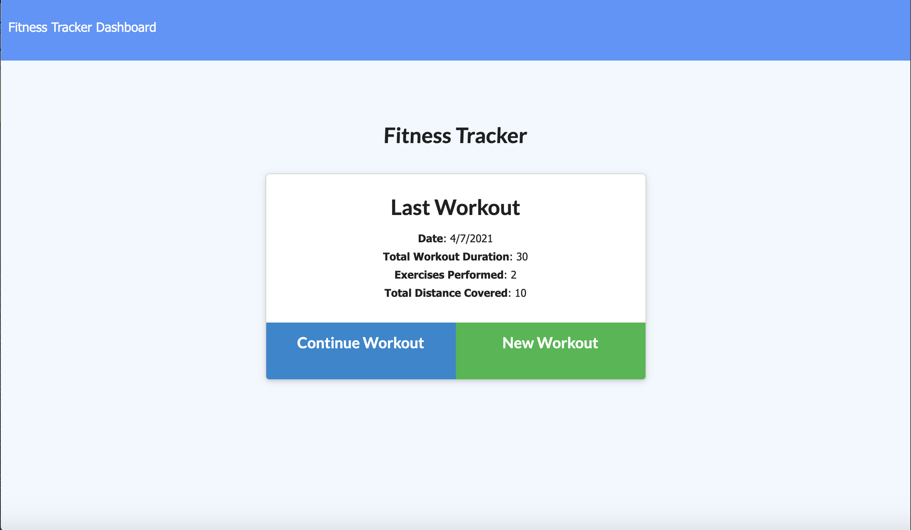
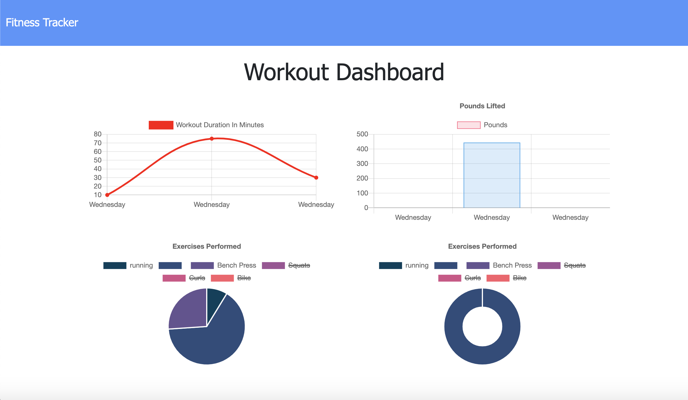

# Workout-Tracker

  [](https://opensource.org/licenses/ISC)

  ## Description
  This is an application that allows a user to create and track their personal workouts. Users are able to log multiple workouts within a single day and track the name, type, weight, sets, reps, ad duration of the exercises.

  ## Table of Contents

  * [Description](#Description)
  * [Installation](#Installation)
  * [Usage](#Usage)
  * [License](#License)
  * [Questions](#Questions)

  ## Installation

  To install necessary dependencies, please run the following command:
  ```
  npm mongoose, npm morgan, npm express
  ```

  ## Usage
  To use, the user will need to enter their workouts through the application and track these workouts in the dashboard. The dashboard can be accessed by clicking the link at the top of the page.

  
  

  ## License
  This project is covered under the ISC license. Visit the following link for more information on this license: [ISC](https://opensource.org/licenses/ISC)


  ## Contributing
  

  ## Tests
  To test, please run the following command:
  ```
  npm test
  ```

  ## Questions
  For any questions about the project, please contact me by either of the following links:
  
  * Email - alexhstrickland@gmail.com 
  
  or visit my GithHub profile
  
  * GitHub - [alexhstrickland](https://github.com/alexhstrickland)

